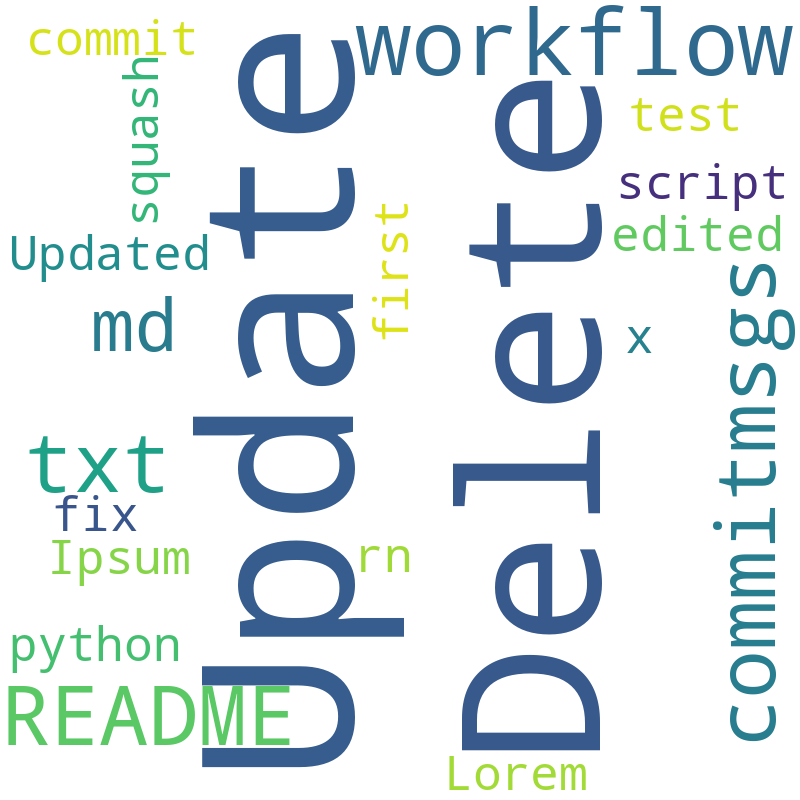

# Creates a wordcloud of all commit messages on push

## Usage
Just import the [workflow](https://github.com/thaemisch/wordcloud-commitmsgs/releases/download/v1.0.0/generate_wordcloud.yml), it will automatically download the required Python script and clean up after itself, leaving only the wordcloud.png and a readme file in the wordcloud/ directory

## Example
In the beginning when the cloud is empty it wont look good, so give it some time.

